Visualization - solutions
================

Setup
-----

The first chunk in an R Notebook is usually titled "setup," and by convention includes the R packages you want to load. Remember, in order to use an R package you have to run some `library()` code every session. Execute these lines of code to load the packages.

``` r
library(ggplot2)
library(fivethirtyeight)
```

Bechdel test data
-----------------

We're going to start by playing with data collected by the website FiveThirtyEight on movies and [the Bechdel test](https://en.wikipedia.org/wiki/Bechdel_test).

To begin, let's just preview our data. There are a couple ways to do that. One is just to type the name of the data and execute it like a piece of code.

``` r
bechdel
```

    ## # A tibble: 1,794 x 15
    ##     year imdb  title test  clean_test binary budget domgross intgross code 
    ##    <int> <chr> <chr> <chr> <ord>      <chr>   <int>    <dbl>    <dbl> <chr>
    ##  1  2013 tt17… 21 &… nota… notalk     FAIL   1.30e7 25682380   4.22e7 2013…
    ##  2  2012 tt13… Dred… ok-d… ok         PASS   4.50e7 13414714   4.09e7 2012…
    ##  3  2013 tt20… 12 Y… nota… notalk     FAIL   2.00e7 53107035   1.59e8 2013…
    ##  4  2013 tt12… 2 Gu… nota… notalk     FAIL   6.10e7 75612460   1.32e8 2013…
    ##  5  2013 tt04… 42    men   men        FAIL   4.00e7 95020213   9.50e7 2013…
    ##  6  2013 tt13… 47 R… men   men        FAIL   2.25e8 38362475   1.46e8 2013…
    ##  7  2013 tt16… A Go… nota… notalk     FAIL   9.20e7 67349198   3.04e8 2013…
    ##  8  2013 tt21… Abou… ok-d… ok         PASS   1.20e7 15323921   8.73e7 2013…
    ##  9  2013 tt18… Admi… ok    ok         PASS   1.30e7 18007317   1.80e7 2013…
    ## 10  2013 tt18… Afte… nota… notalk     FAIL   1.30e8 60522097   2.44e8 2013…
    ## # … with 1,784 more rows, and 5 more variables: budget_2013 <int>,
    ## #   domgross_2013 <dbl>, intgross_2013 <dbl>, period_code <int>,
    ## #   decade_code <int>

Notice that you can page through to see more of the dataset.

Sometimes, people prefer to see their data in a more spreadsheet-like format, and RStudio provides a way to do that. Go to the Console and type `View(bechdel)` to see the data preview.

(An aside-- `View` is a special function. Since it makes something happen in the RStudio interface, it doesn't work properly in R Notebooks. Most R functions have names that start with lowercase letters, so the uppercase "V" is there to remind you of its special status.)

Consider
--------

What relationship do you expect to see between movie budget (budget) and domestic gross(domgross)?

Your Turn 1
-----------

Run the code on the slide to make a graph. Pay strict attention to spelling, capitalization, and parentheses!

``` r
ggplot(data = bechdel) +
  geom_point(mapping = aes(x = budget, y = domgross))
```

    ## Warning: Removed 17 rows containing missing values (geom_point).

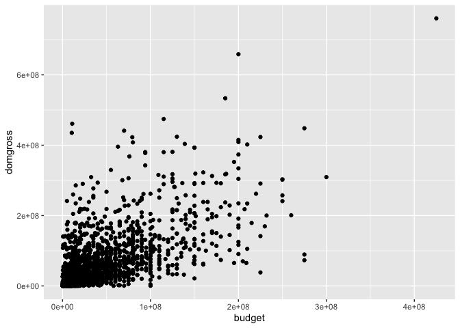

Your Turn 2
-----------

Add `color`, `size`, `alpha`, and `shape` aesthetics to your graph. Experiment.

``` r
ggplot(data = bechdel) +
  geom_point(mapping = aes(x = budget, y = domgross, color=clean_test))
```

    ## Warning: Removed 17 rows containing missing values (geom_point).

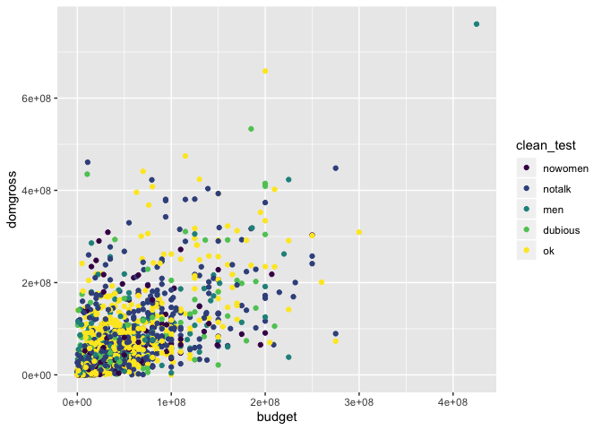

``` r
ggplot(bechdel) + 
  geom_point(mapping = aes(x = budget, y = domgross, size=clean_test))
```

    ## Warning: Removed 17 rows containing missing values (geom_point).

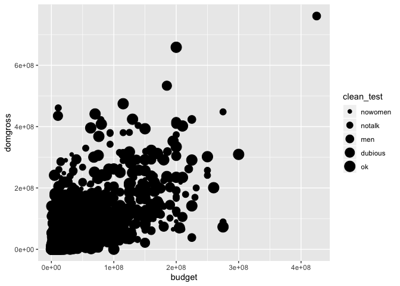

``` r
ggplot(bechdel) + 
  geom_point(mapping = aes(x = budget, y = domgross, shape=clean_test))
```

    ## Warning: Using shapes for an ordinal variable is not advised

    ## Warning: Removed 17 rows containing missing values (geom_point).

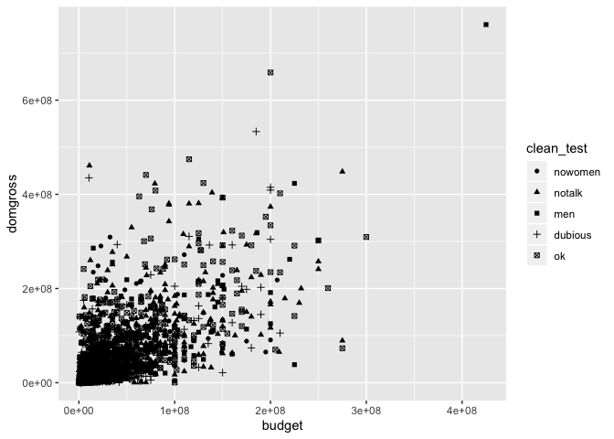

``` r
ggplot(bechdel) + 
  geom_point(mapping = aes(x = budget, y = domgross, alpha=clean_test))
```

    ## Warning: Removed 17 rows containing missing values (geom_point).


Set vs map
----------

``` r
ggplot(bechdel) + 
    geom_point(mapping = aes(x = budget, y = domgross), color="blue")
```

    ## Warning: Removed 17 rows containing missing values (geom_point).

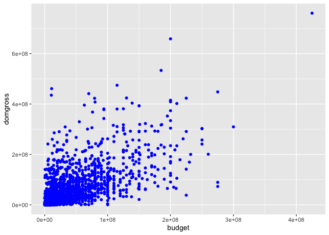

Your Turn 3
-----------

Replace this scatterplot with one that draws boxplots. Use the cheatsheet. Try your best guess.

``` r
ggplot(data = bechdel) + geom_point(aes(x = clean_test, y = budget))
```

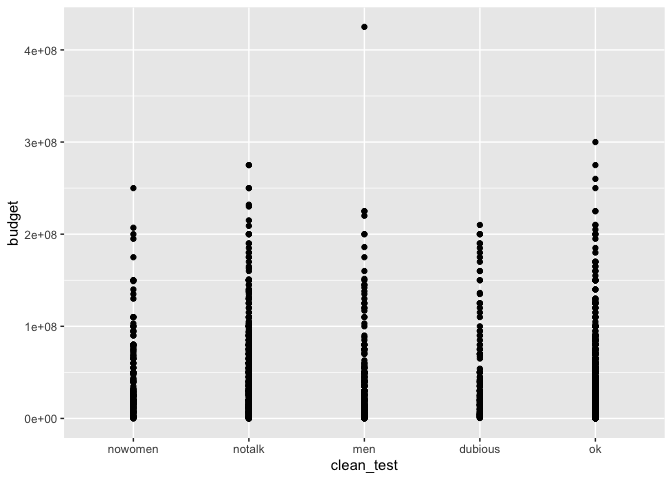

``` r
ggplot(data = bechdel) + geom_boxplot(aes(x = clean_test, y = budget))
```


Your Turn 4
-----------

Make a histogram of the `budget` variable from `bechdel`.

``` r
ggplot(bechdel) + 
  geom_histogram(aes(x=budget))
```

    ## `stat_bin()` using `bins = 30`. Pick better value with `binwidth`.


Your Turn 5
-----------

Try to find a better binwidth for `budget`.

``` r
ggplot(data = bechdel) +
  geom_histogram(mapping = aes(x = budget), binwidth=10000000)
```

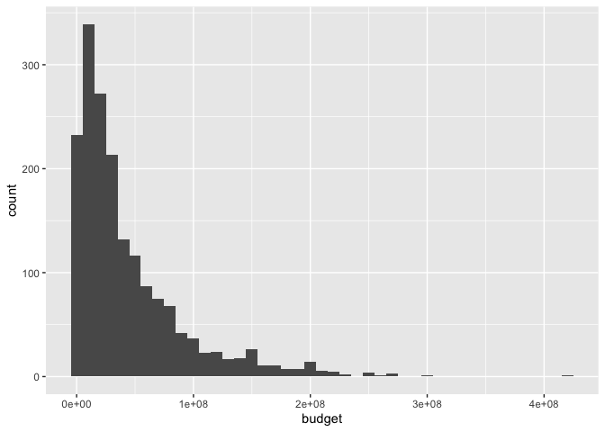

Your Turn 6
-----------

Make a density plot of `budget` colored by `clean_test`.

``` r
ggplot(data = bechdel) +
  geom_density(mapping = aes(x = budget))
```

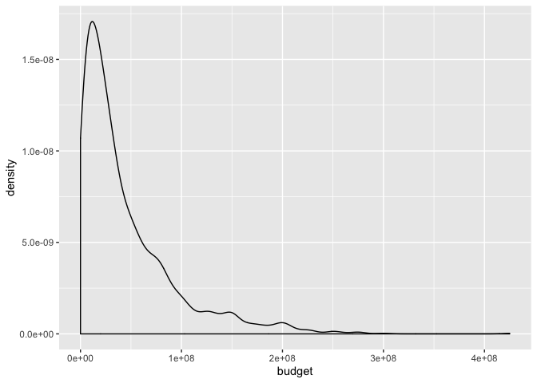

``` r
ggplot(data = bechdel) +
  geom_density(mapping = aes(x = budget, color=clean_test))
```

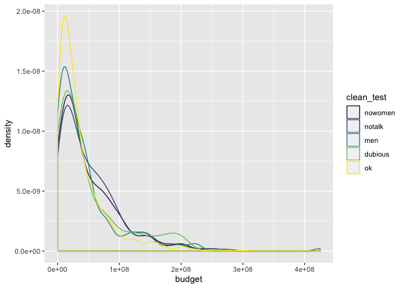

Your Turn 7
-----------

Make a barchart of `clean_test` colored by `clean_test`.

``` r
ggplot(data=bechdel) +
  geom_bar(mapping = aes(x = clean_test, fill = clean_test))
```

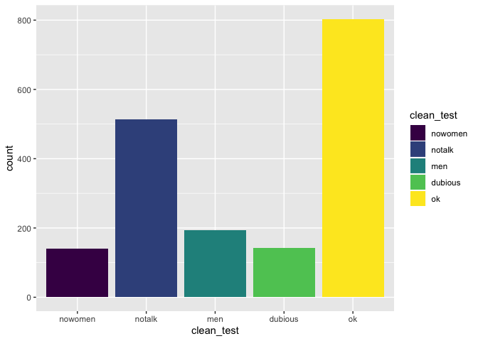

Your Turn 8
-----------

Predict what this code will do. Then run it.

``` r
ggplot(bechdel) + 
  geom_point(aes(budget, domgross)) +
  geom_smooth(aes(budget, domgross))
```

    ## `geom_smooth()` using method = 'gam' and formula 'y ~ s(x, bs = "cs")'

    ## Warning: Removed 17 rows containing non-finite values (stat_smooth).

    ## Warning: Removed 17 rows containing missing values (geom_point).

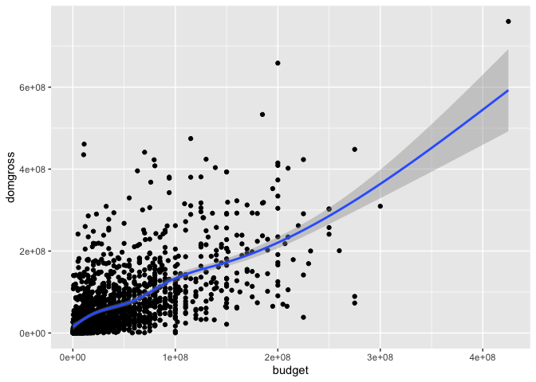

global vs local
---------------

``` r
ggplot(data = bechdel, mapping = aes(x = budget, y = domgross)) +
  geom_point(mapping = aes(color = clean_test)) +
  geom_smooth()
```

    ## `geom_smooth()` using method = 'gam' and formula 'y ~ s(x, bs = "cs")'

    ## Warning: Removed 17 rows containing non-finite values (stat_smooth).

    ## Warning: Removed 17 rows containing missing values (geom_point).

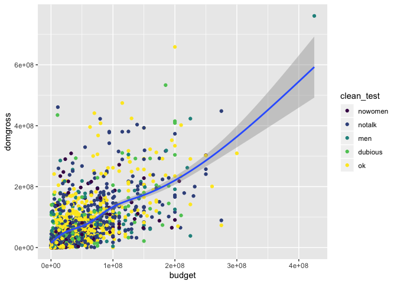

``` r
library(dplyr)
```

    ## 
    ## Attaching package: 'dplyr'

    ## The following objects are masked from 'package:stats':
    ## 
    ##     filter, lag

    ## The following objects are masked from 'package:base':
    ## 
    ##     intersect, setdiff, setequal, union

``` r
ggplot(data = bechdel, mapping = aes(x = budget, y = domgross)) +
  geom_point(mapping = aes(color = clean_test)) +
  geom_smooth(data = filter(bechdel, clean_test == "ok"))
```

    ## `geom_smooth()` using method = 'loess' and formula 'y ~ x'

    ## Warning: Removed 9 rows containing non-finite values (stat_smooth).

    ## Warning: Removed 17 rows containing missing values (geom_point).

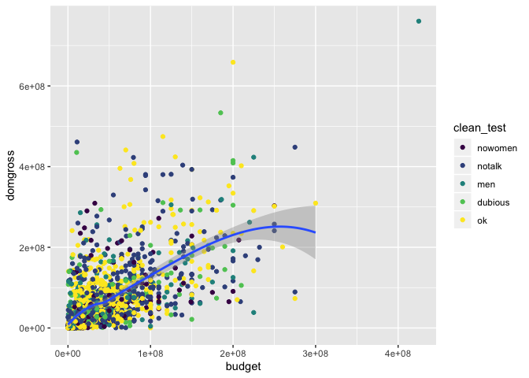

Your Turn
---------

What does `getwd()` return?

``` r
getwd()
```

    ## [1] "/Users/amcnamara/data-science-tidy/materials/solutions"

Your Turn 9
-----------

Save the last plot and then locate it in the files pane. If you run your `ggsave()` code inside this notebook, the image will be saved in the same directory as your .Rmd file (likely, project -&gt; code), but if you run `ggsave()` in the Console it will be in your working directory.

``` r
ggsave("my-plot.png")
```

    ## Saving 7 x 5 in image

    ## `geom_smooth()` using method = 'loess' and formula 'y ~ x'

    ## Warning: Removed 9 rows containing non-finite values (stat_smooth).

    ## Warning: Removed 17 rows containing missing values (geom_point).

------------------------------------------------------------------------

Take aways
==========

You can use this code template to make thousands of graphs with **ggplot2**.

``` r
ggplot(data = <DATA>) +
  <GEOM_FUNCTION>(mapping = aes(<MAPPINGS>))
```

<!-- This file by Amelia McNamara is licensed under a Creative Commons Attribution 4.0 International License, adapted from the orignal work at https://github.com/rstudio/master-the-tidyverse by RStudio. -->
