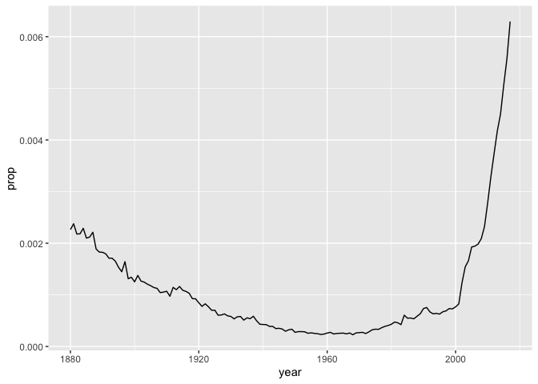
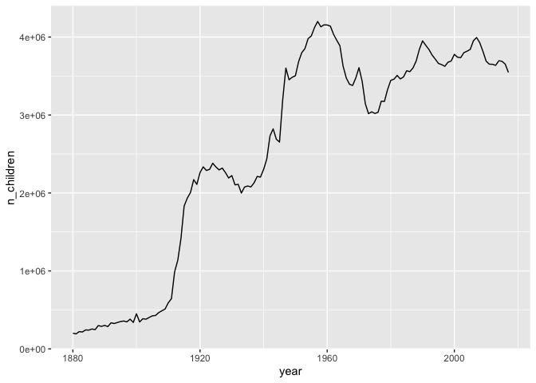

Transform Data - solutions
================

``` r
library(tidyverse)
```

    ## ── Attaching packages ────────────────────────── tidyverse 1.2.1 ──

    ## ✔ ggplot2 3.2.0     ✔ purrr   0.3.2
    ## ✔ tibble  2.1.3     ✔ dplyr   0.8.3
    ## ✔ tidyr   1.0.0     ✔ stringr 1.4.0
    ## ✔ readr   1.1.1     ✔ forcats 0.4.0

    ## ── Conflicts ───────────────────────────── tidyverse_conflicts() ──
    ## ✖ dplyr::filter() masks stats::filter()
    ## ✖ dplyr::lag()    masks stats::lag()

``` r
library(babynames)
library(nycflights13)
library(skimr)
```

## Babynames

``` r
babynames
```

    ## # A tibble: 1,924,665 x 5
    ##     year sex   name          n   prop
    ##    <dbl> <chr> <chr>     <int>  <dbl>
    ##  1  1880 F     Mary       7065 0.0724
    ##  2  1880 F     Anna       2604 0.0267
    ##  3  1880 F     Emma       2003 0.0205
    ##  4  1880 F     Elizabeth  1939 0.0199
    ##  5  1880 F     Minnie     1746 0.0179
    ##  6  1880 F     Margaret   1578 0.0162
    ##  7  1880 F     Ida        1472 0.0151
    ##  8  1880 F     Alice      1414 0.0145
    ##  9  1880 F     Bertha     1320 0.0135
    ## 10  1880 F     Sarah      1288 0.0132
    ## # … with 1,924,655 more rows

``` r
skim(babynames)
```

    ## Warning: `cols` is now required.
    ## Please use `cols = c(by_variable)`
    
    ## Warning: `cols` is now required.
    ## Please use `cols = c(by_variable)`

    ## Warning: `cols` is now required.
    ## Please use `cols = c(skimmed)`

|                                          |                     |
| :--------------------------------------- | :------------------ |
| Name Number of rows Number of columns    | babynames 1924665 5 |
| Column type frequency: character numeric | 2 3                 |
| Group variables                          | None                |

Data summary

**Variable type:
character**

| skim\_variable | missing | complete |       n | min | max | empty | n\_unique | whitespace |
| :------------- | ------: | -------: | ------: | --: | --: | ----: | --------: | ---------: |
| sex            |       0 |  1924665 | 1924665 |   1 |   1 |     0 |         2 |          0 |
| name           |       0 |  1924665 | 1924665 |   2 |  15 |     0 |     97310 |          0 |

**Variable type:
numeric**

| skim\_variable | missing | complete |       n |    mean |      sd |   p0 |  p25 |  p50 |  p75 |     p100 | hist  |
| :------------- | ------: | -------: | ------: | ------: | ------: | ---: | ---: | ---: | ---: | -------: | :---- |
| year           |       0 |  1924665 | 1924665 | 1974.85 |   34.03 | 1880 | 1951 | 1985 | 2003 |  2017.00 | ▁▂▃▅▇ |
| n              |       0 |  1924665 | 1924665 |  180.87 | 1533.34 |    5 |    7 |   12 |   32 | 99686.00 | ▇▁▁▁▁ |
| prop           |       0 |  1924665 | 1924665 |    0.00 |    0.00 |    0 |    0 |    0 |    0 |     0.08 | ▇▁▁▁▁ |

``` r
my_skim <- skim_with(numeric = sfl(p25 = NULL, p75=NULL))
my_skim(babynames)
```

    ## Warning: `cols` is now required.
    ## Please use `cols = c(by_variable)`

    ## Warning: `cols` is now required.
    ## Please use `cols = c(by_variable)`

    ## Warning: `cols` is now required.
    ## Please use `cols = c(skimmed)`

|                                          |                     |
| :--------------------------------------- | :------------------ |
| Name Number of rows Number of columns    | babynames 1924665 5 |
| Column type frequency: character numeric | 2 3                 |
| Group variables                          | None                |

Data summary

**Variable type:
character**

| skim\_variable | missing | complete |       n | min | max | empty | n\_unique | whitespace |
| :------------- | ------: | -------: | ------: | --: | --: | ----: | --------: | ---------: |
| sex            |       0 |  1924665 | 1924665 |   1 |   1 |     0 |         2 |          0 |
| name           |       0 |  1924665 | 1924665 |   2 |  15 |     0 |     97310 |          0 |

**Variable type:
numeric**

| skim\_variable | missing | complete |       n |    mean |      sd |   p0 |  p50 |     p100 | hist  |
| :------------- | ------: | -------: | ------: | ------: | ------: | ---: | ---: | -------: | :---- |
| year           |       0 |  1924665 | 1924665 | 1974.85 |   34.03 | 1880 | 1985 |  2017.00 | ▁▂▃▅▇ |
| n              |       0 |  1924665 | 1924665 |  180.87 | 1533.34 |    5 |   12 | 99686.00 | ▇▁▁▁▁ |
| prop           |       0 |  1924665 | 1924665 |    0.00 |    0.00 |    0 |    0 |     0.08 | ▇▁▁▁▁ |

## Your Turn 1

Run the skim\_with() command, and then try skimming babynames again to
see how the output is different

``` r
skim(babynames)
```

    ## Warning: `cols` is now required.
    ## Please use `cols = c(by_variable)`
    
    ## Warning: `cols` is now required.
    ## Please use `cols = c(by_variable)`

    ## Warning: `cols` is now required.
    ## Please use `cols = c(skimmed)`

|                                          |                     |
| :--------------------------------------- | :------------------ |
| Name Number of rows Number of columns    | babynames 1924665 5 |
| Column type frequency: character numeric | 2 3                 |
| Group variables                          | None                |

Data summary

**Variable type:
character**

| skim\_variable | missing | complete |       n | min | max | empty | n\_unique | whitespace |
| :------------- | ------: | -------: | ------: | --: | --: | ----: | --------: | ---------: |
| sex            |       0 |  1924665 | 1924665 |   1 |   1 |     0 |         2 |          0 |
| name           |       0 |  1924665 | 1924665 |   2 |  15 |     0 |     97310 |          0 |

**Variable type:
numeric**

| skim\_variable | missing | complete |       n |    mean |      sd |   p0 |  p25 |  p50 |  p75 |     p100 | hist  |
| :------------- | ------: | -------: | ------: | ------: | ------: | ---: | ---: | ---: | ---: | -------: | :---- |
| year           |       0 |  1924665 | 1924665 | 1974.85 |   34.03 | 1880 | 1951 | 1985 | 2003 |  2017.00 | ▁▂▃▅▇ |
| n              |       0 |  1924665 | 1924665 |  180.87 | 1533.34 |    5 |    7 |   12 |   32 | 99686.00 | ▇▁▁▁▁ |
| prop           |       0 |  1924665 | 1924665 |    0.00 |    0.00 |    0 |    0 |    0 |    0 |     0.08 | ▇▁▁▁▁ |

## Select

``` r
select(babynames, name, prop)
```

    ## # A tibble: 1,924,665 x 2
    ##    name        prop
    ##    <chr>      <dbl>
    ##  1 Mary      0.0724
    ##  2 Anna      0.0267
    ##  3 Emma      0.0205
    ##  4 Elizabeth 0.0199
    ##  5 Minnie    0.0179
    ##  6 Margaret  0.0162
    ##  7 Ida       0.0151
    ##  8 Alice     0.0145
    ##  9 Bertha    0.0135
    ## 10 Sarah     0.0132
    ## # … with 1,924,655 more rows

## Your Turn 2

Alter the code to select just the `n` column:

``` r
select(babynames, n)
```

    ## # A tibble: 1,924,665 x 1
    ##        n
    ##    <int>
    ##  1  7065
    ##  2  2604
    ##  3  2003
    ##  4  1939
    ##  5  1746
    ##  6  1578
    ##  7  1472
    ##  8  1414
    ##  9  1320
    ## 10  1288
    ## # … with 1,924,655 more rows

## Consider

Which of these is NOT a way to select the `name` and `n` columns
together?

``` r
select(babynames, -c(year, sex, prop))
```

    ## # A tibble: 1,924,665 x 2
    ##    name          n
    ##    <chr>     <int>
    ##  1 Mary       7065
    ##  2 Anna       2604
    ##  3 Emma       2003
    ##  4 Elizabeth  1939
    ##  5 Minnie     1746
    ##  6 Margaret   1578
    ##  7 Ida        1472
    ##  8 Alice      1414
    ##  9 Bertha     1320
    ## 10 Sarah      1288
    ## # … with 1,924,655 more rows

``` r
select(babynames, name:n)
```

    ## # A tibble: 1,924,665 x 2
    ##    name          n
    ##    <chr>     <int>
    ##  1 Mary       7065
    ##  2 Anna       2604
    ##  3 Emma       2003
    ##  4 Elizabeth  1939
    ##  5 Minnie     1746
    ##  6 Margaret   1578
    ##  7 Ida        1472
    ##  8 Alice      1414
    ##  9 Bertha     1320
    ## 10 Sarah      1288
    ## # … with 1,924,655 more rows

``` r
select(babynames, starts_with("n"))
```

    ## # A tibble: 1,924,665 x 2
    ##    name          n
    ##    <chr>     <int>
    ##  1 Mary       7065
    ##  2 Anna       2604
    ##  3 Emma       2003
    ##  4 Elizabeth  1939
    ##  5 Minnie     1746
    ##  6 Margaret   1578
    ##  7 Ida        1472
    ##  8 Alice      1414
    ##  9 Bertha     1320
    ## 10 Sarah      1288
    ## # … with 1,924,655 more rows

``` r
select(babynames, ends_with("n"))
```

    ## # A tibble: 1,924,665 x 1
    ##        n
    ##    <int>
    ##  1  7065
    ##  2  2604
    ##  3  2003
    ##  4  1939
    ##  5  1746
    ##  6  1578
    ##  7  1472
    ##  8  1414
    ##  9  1320
    ## 10  1288
    ## # … with 1,924,655 more rows

## Your Turn 3

Show:

  - All of the names where prop is greater than or equal to 0.08  
  - All of the children named “Sea”  
  - All of the names that have a missing value for `n`

<!-- end list -->

``` r
filter(babynames, prop >= 0.08)
```

    ## # A tibble: 3 x 5
    ##    year sex   name        n   prop
    ##   <dbl> <chr> <chr>   <int>  <dbl>
    ## 1  1880 M     John     9655 0.0815
    ## 2  1880 M     William  9532 0.0805
    ## 3  1881 M     John     8769 0.0810

``` r
filter(babynames, name == "Sea")
```

    ## # A tibble: 4 x 5
    ##    year sex   name      n       prop
    ##   <dbl> <chr> <chr> <int>      <dbl>
    ## 1  1982 F     Sea       5 0.00000276
    ## 2  1985 M     Sea       6 0.00000312
    ## 3  1986 M     Sea       5 0.0000026 
    ## 4  1998 F     Sea       5 0.00000258

``` r
filter(babynames, is.na(n))
```

    ## # A tibble: 0 x 5
    ## # … with 5 variables: year <dbl>, sex <chr>, name <chr>, n <int>,
    ## #   prop <dbl>

## Your Turn 4

Use Boolean operators to alter the code below to return only the rows
that contain:

  - Girls named Sea  
  - Names that were used by exactly 5 or 6 children in 1880  
  - Names that are one of Acura, Lexus, or Yugo

<!-- end list -->

``` r
filter(babynames, name == "Sea", sex == "F")
```

    ## # A tibble: 2 x 5
    ##    year sex   name      n       prop
    ##   <dbl> <chr> <chr> <int>      <dbl>
    ## 1  1982 F     Sea       5 0.00000276
    ## 2  1998 F     Sea       5 0.00000258

``` r
filter(babynames, n == 5 | n == 6, year == 1880)
```

    ## # A tibble: 455 x 5
    ##     year sex   name        n      prop
    ##    <dbl> <chr> <chr>   <int>     <dbl>
    ##  1  1880 F     Abby        6 0.0000615
    ##  2  1880 F     Aileen      6 0.0000615
    ##  3  1880 F     Alba        6 0.0000615
    ##  4  1880 F     Alda        6 0.0000615
    ##  5  1880 F     Alla        6 0.0000615
    ##  6  1880 F     Alverta     6 0.0000615
    ##  7  1880 F     Ara         6 0.0000615
    ##  8  1880 F     Ardelia     6 0.0000615
    ##  9  1880 F     Ardella     6 0.0000615
    ## 10  1880 F     Arrie       6 0.0000615
    ## # … with 445 more rows

``` r
filter(babynames, name %in% c("Acura", "Lexus", "Yugo"))
```

    ## # A tibble: 57 x 5
    ##     year sex   name      n       prop
    ##    <dbl> <chr> <chr> <int>      <dbl>
    ##  1  1990 F     Lexus    36 0.0000175 
    ##  2  1990 M     Lexus    12 0.00000558
    ##  3  1991 F     Lexus   102 0.0000502 
    ##  4  1991 M     Lexus    16 0.00000755
    ##  5  1992 F     Lexus   193 0.0000963 
    ##  6  1992 M     Lexus    25 0.0000119 
    ##  7  1993 F     Lexus   285 0.000145  
    ##  8  1993 M     Lexus    30 0.0000145 
    ##  9  1994 F     Lexus   381 0.000195  
    ## 10  1994 F     Acura     6 0.00000308
    ## # … with 47 more rows

## Arrange

``` r
arrange(babynames, n)
```

    ## # A tibble: 1,924,665 x 5
    ##     year sex   name          n      prop
    ##    <dbl> <chr> <chr>     <int>     <dbl>
    ##  1  1880 F     Adelle        5 0.0000512
    ##  2  1880 F     Adina         5 0.0000512
    ##  3  1880 F     Adrienne      5 0.0000512
    ##  4  1880 F     Albertine     5 0.0000512
    ##  5  1880 F     Alys          5 0.0000512
    ##  6  1880 F     Ana           5 0.0000512
    ##  7  1880 F     Araminta      5 0.0000512
    ##  8  1880 F     Arthur        5 0.0000512
    ##  9  1880 F     Birtha        5 0.0000512
    ## 10  1880 F     Bulah         5 0.0000512
    ## # … with 1,924,655 more rows

## Your Turn 5

Arrange babynames by `n`. Add `prop` as a second (tie breaking) variable
to arrange on. Can you tell what the smallest value of `n` is?

``` r
arrange(babynames, n, prop)
```

    ## # A tibble: 1,924,665 x 5
    ##     year sex   name            n       prop
    ##    <dbl> <chr> <chr>       <int>      <dbl>
    ##  1  2007 M     Aaban           5 0.00000226
    ##  2  2007 M     Aareon          5 0.00000226
    ##  3  2007 M     Aaris           5 0.00000226
    ##  4  2007 M     Abd             5 0.00000226
    ##  5  2007 M     Abdulazeez      5 0.00000226
    ##  6  2007 M     Abdulhadi       5 0.00000226
    ##  7  2007 M     Abdulhamid      5 0.00000226
    ##  8  2007 M     Abdulkadir      5 0.00000226
    ##  9  2007 M     Abdulraheem     5 0.00000226
    ## 10  2007 M     Abdulrahim      5 0.00000226
    ## # … with 1,924,655 more rows

## desc

``` r
arrange(babynames, desc(n))
```

    ## # A tibble: 1,924,665 x 5
    ##     year sex   name        n   prop
    ##    <dbl> <chr> <chr>   <int>  <dbl>
    ##  1  1947 F     Linda   99686 0.0548
    ##  2  1948 F     Linda   96209 0.0552
    ##  3  1947 M     James   94756 0.0510
    ##  4  1957 M     Michael 92695 0.0424
    ##  5  1947 M     Robert  91642 0.0493
    ##  6  1949 F     Linda   91016 0.0518
    ##  7  1956 M     Michael 90620 0.0423
    ##  8  1958 M     Michael 90520 0.0420
    ##  9  1948 M     James   88588 0.0497
    ## 10  1954 M     Michael 88514 0.0428
    ## # … with 1,924,655 more rows

## Your Turn 6

Use `desc()` to find the names with the highest prop. Then, use `desc()`
to find the names with the highest n.

``` r
arrange(babynames, desc(prop))
```

    ## # A tibble: 1,924,665 x 5
    ##     year sex   name        n   prop
    ##    <dbl> <chr> <chr>   <int>  <dbl>
    ##  1  1880 M     John     9655 0.0815
    ##  2  1881 M     John     8769 0.0810
    ##  3  1880 M     William  9532 0.0805
    ##  4  1883 M     John     8894 0.0791
    ##  5  1881 M     William  8524 0.0787
    ##  6  1882 M     John     9557 0.0783
    ##  7  1884 M     John     9388 0.0765
    ##  8  1882 M     William  9298 0.0762
    ##  9  1886 M     John     9026 0.0758
    ## 10  1885 M     John     8756 0.0755
    ## # … with 1,924,655 more rows

``` r
arrange(babynames, desc(n))
```

    ## # A tibble: 1,924,665 x 5
    ##     year sex   name        n   prop
    ##    <dbl> <chr> <chr>   <int>  <dbl>
    ##  1  1947 F     Linda   99686 0.0548
    ##  2  1948 F     Linda   96209 0.0552
    ##  3  1947 M     James   94756 0.0510
    ##  4  1957 M     Michael 92695 0.0424
    ##  5  1947 M     Robert  91642 0.0493
    ##  6  1949 F     Linda   91016 0.0518
    ##  7  1956 M     Michael 90620 0.0423
    ##  8  1958 M     Michael 90520 0.0420
    ##  9  1948 M     James   88588 0.0497
    ## 10  1954 M     Michael 88514 0.0428
    ## # … with 1,924,655 more rows

## Steps and the pipe

``` r
babynames %>%
  filter(year == 2015, sex == "M") %>%
  select(name, n) %>%
  arrange(desc(n))
```

    ## # A tibble: 14,024 x 2
    ##    name          n
    ##    <chr>     <int>
    ##  1 Noah      19613
    ##  2 Liam      18355
    ##  3 Mason     16610
    ##  4 Jacob     15938
    ##  5 William   15889
    ##  6 Ethan     15069
    ##  7 James     14799
    ##  8 Alexander 14531
    ##  9 Michael   14413
    ## 10 Benjamin  13692
    ## # … with 14,014 more rows

## Your Turn 7

Use `%>%` to write a sequence of functions that:

1.  Filter babynames to just the girls that were born in 2015  
2.  Select the `name` and `n` columns  
3.  Arrange the results so that the most popular names are near the top.

<!-- end list -->

``` r
babynames %>% 
  filter(year == 2015, sex == "F") %>% 
  select(name, n) %>% 
  arrange(desc(n))
```

    ## # A tibble: 19,074 x 2
    ##    name          n
    ##    <chr>     <int>
    ##  1 Emma      20435
    ##  2 Olivia    19669
    ##  3 Sophia    17402
    ##  4 Ava       16361
    ##  5 Isabella  15594
    ##  6 Mia       14892
    ##  7 Abigail   12390
    ##  8 Emily     11780
    ##  9 Charlotte 11390
    ## 10 Harper    10291
    ## # … with 19,064 more rows

## Your Turn 8

1.  Trim `babynames` to just the rows that contain your `name` and your
    `sex`  
2.  Trim the result to just the columns that will appear in your graph
    (not strictly necessary, but useful practice)  
3.  Plot the results as a line graph with `year` on the x axis and
    `prop` on the y axis

<!-- end list -->

``` r
babynames %>% 
  filter(name == "Amelia", sex == "F") %>%
  select(year, prop) %>%
  ggplot() +
    geom_line(mapping = aes(year, prop))
```

<!-- -->

## Your Turn 9

Use summarise() to compute three statistics about the data:

1.  The first (minimum) year in the dataset  
2.  The last (maximum) year in the dataset  
3.  The total number of children represented in the data

<!-- end list -->

``` r
babynames %>% 
  summarise(first = min(year), 
            last = max(year), 
            total = sum(n))
```

    ## # A tibble: 1 x 3
    ##   first  last     total
    ##   <dbl> <dbl>     <int>
    ## 1  1880  2017 348120517

## Your Turn 10

Extract the rows where `name == "Khaleesi"`. Then use `summarise()` and
a summary functions to find:

1.  The total number of children named Khaleesi
2.  The first year Khaleesi appeared in the data

<!-- end list -->

``` r
babynames %>% 
  filter(name == "Khaleesi") %>% 
  summarise(total = sum(n), first = min(year))
```

    ## # A tibble: 1 x 2
    ##   total first
    ##   <int> <dbl>
    ## 1  1964  2011

## Toy data for transforming

``` r
# Toy dataset to use
pollution <- tribble(
       ~city,   ~size, ~amount, 
  "New York", "large",      23,
  "New York", "small",      14,
    "London", "large",      22,
    "London", "small",      16,
   "Beijing", "large",      121,
   "Beijing", "small",      56
)
```

## Summarize

``` r
pollution %>% 
 summarise(mean = mean(amount), sum = sum(amount), n = n())
```

    ## # A tibble: 1 x 3
    ##    mean   sum     n
    ##   <dbl> <dbl> <int>
    ## 1    42   252     6

``` r
pollution %>% 
  group_by(city) %>%
  summarise(mean = mean(amount), sum = sum(amount), n = n())
```

    ## # A tibble: 3 x 4
    ##   city      mean   sum     n
    ##   <chr>    <dbl> <dbl> <int>
    ## 1 Beijing   88.5   177     2
    ## 2 London    19      38     2
    ## 3 New York  18.5    37     2

## Your Turn 11

Use `group_by()`, `summarise()`, and `arrange()` to display the ten most
popular names. Compute popularity as the total number of children of a
single gender given a name.

``` r
babynames %>%
  group_by(name, sex) %>% 
  summarise(total = sum(n)) %>% 
  arrange(desc(total))
```

    ## # A tibble: 107,973 x 3
    ##    name    sex     total
    ##    <chr>   <chr>   <int>
    ##  1 James   M     5150472
    ##  2 John    M     5115466
    ##  3 Robert  M     4814815
    ##  4 Michael M     4350824
    ##  5 Mary    F     4123200
    ##  6 William M     4102604
    ##  7 David   M     3611329
    ##  8 Joseph  M     2603445
    ##  9 Richard M     2563082
    ## 10 Charles M     2386048
    ## # … with 107,963 more rows

## Your Turn 12

Use grouping to calculate and then plot the number of children born each
year over time.

``` r
babynames %>%
  group_by(year) %>% 
  summarise(n_children = sum(n)) %>% 
  ggplot() +
    geom_line(mapping = aes(x = year, y = n_children))
```

<!-- -->

## Ungroup

``` r
babynames %>%
  group_by(name, sex) %>% 
  summarise(total = sum(n)) %>% 
  arrange(desc(total))
```

    ## # A tibble: 107,973 x 3
    ##    name    sex     total
    ##    <chr>   <chr>   <int>
    ##  1 James   M     5150472
    ##  2 John    M     5115466
    ##  3 Robert  M     4814815
    ##  4 Michael M     4350824
    ##  5 Mary    F     4123200
    ##  6 William M     4102604
    ##  7 David   M     3611329
    ##  8 Joseph  M     2603445
    ##  9 Richard M     2563082
    ## 10 Charles M     2386048
    ## # … with 107,963 more rows

## Mutate

``` r
babynames %>%
  mutate(percent = round(prop*100, 2))
```

    ## # A tibble: 1,924,665 x 6
    ##     year sex   name          n   prop percent
    ##    <dbl> <chr> <chr>     <int>  <dbl>   <dbl>
    ##  1  1880 F     Mary       7065 0.0724    7.24
    ##  2  1880 F     Anna       2604 0.0267    2.67
    ##  3  1880 F     Emma       2003 0.0205    2.05
    ##  4  1880 F     Elizabeth  1939 0.0199    1.99
    ##  5  1880 F     Minnie     1746 0.0179    1.79
    ##  6  1880 F     Margaret   1578 0.0162    1.62
    ##  7  1880 F     Ida        1472 0.0151    1.51
    ##  8  1880 F     Alice      1414 0.0145    1.45
    ##  9  1880 F     Bertha     1320 0.0135    1.35
    ## 10  1880 F     Sarah      1288 0.0132    1.32
    ## # … with 1,924,655 more rows

## Your Turn 13

Use `min_rank()` and `mutate()` to rank each row in `babynames` from
largest `n` to lowest `n`.

``` r
babynames %>% 
  mutate(rank = min_rank(desc(prop)))
```

    ## # A tibble: 1,924,665 x 6
    ##     year sex   name          n   prop  rank
    ##    <dbl> <chr> <chr>     <int>  <dbl> <int>
    ##  1  1880 F     Mary       7065 0.0724    14
    ##  2  1880 F     Anna       2604 0.0267   709
    ##  3  1880 F     Emma       2003 0.0205  1131
    ##  4  1880 F     Elizabeth  1939 0.0199  1192
    ##  5  1880 F     Minnie     1746 0.0179  1427
    ##  6  1880 F     Margaret   1578 0.0162  1683
    ##  7  1880 F     Ida        1472 0.0151  1897
    ##  8  1880 F     Alice      1414 0.0145  2039
    ##  9  1880 F     Bertha     1320 0.0135  2279
    ## 10  1880 F     Sarah      1288 0.0132  2387
    ## # … with 1,924,655 more rows

## Your Turn 14

Compute each name’s rank *within its year and sex*. Then compute the
median rank *for each combination of name and sex*, and arrange the
results from highest median rank to lowest.

``` r
babynames %>% 
  group_by(year, sex) %>% 
  mutate(rank = min_rank(desc(prop))) %>% 
  group_by(name, sex) %>% 
  summarise(score = median(rank)) %>% 
  arrange(score)
```

    ## # A tibble: 107,973 x 3
    ##    name      sex   score
    ##    <chr>     <chr> <dbl>
    ##  1 Mary      F       1  
    ##  2 James     M       3  
    ##  3 John      M       3  
    ##  4 William   M       4  
    ##  5 Robert    M       6  
    ##  6 Michael   M       7.5
    ##  7 Charles   M       9  
    ##  8 Elizabeth F      10  
    ##  9 Joseph    M      10  
    ## 10 Thomas    M      11  
    ## # … with 107,963 more rows

## Flights data

``` r
flights
```

    ## # A tibble: 336,776 x 19
    ##     year month   day dep_time sched_dep_time dep_delay arr_time
    ##    <int> <int> <int>    <int>          <int>     <dbl>    <int>
    ##  1  2013     1     1      517            515         2      830
    ##  2  2013     1     1      533            529         4      850
    ##  3  2013     1     1      542            540         2      923
    ##  4  2013     1     1      544            545        -1     1004
    ##  5  2013     1     1      554            600        -6      812
    ##  6  2013     1     1      554            558        -4      740
    ##  7  2013     1     1      555            600        -5      913
    ##  8  2013     1     1      557            600        -3      709
    ##  9  2013     1     1      557            600        -3      838
    ## 10  2013     1     1      558            600        -2      753
    ## # … with 336,766 more rows, and 12 more variables: sched_arr_time <int>,
    ## #   arr_delay <dbl>, carrier <chr>, flight <int>, tailnum <chr>,
    ## #   origin <chr>, dest <chr>, air_time <dbl>, distance <dbl>, hour <dbl>,
    ## #   minute <dbl>, time_hour <dttm>

``` r
skim(flights)
```

    ## Warning: `cols` is now required.
    ## Please use `cols = c(by_variable)`
    
    ## Warning: `cols` is now required.
    ## Please use `cols = c(by_variable)`

    ## Warning: `cols` is now required.
    ## Please use `cols = c(skimmed)`

|                                                  |                   |
| :----------------------------------------------- | :---------------- |
| Name Number of rows Number of columns            | flights 336776 19 |
| Column type frequency: character numeric POSIXct | 4 14 1            |
| Group variables                                  | None              |

Data summary

**Variable type:
character**

| skim\_variable | missing | complete |      n | min | max | empty | n\_unique | whitespace |
| :------------- | ------: | -------: | -----: | --: | --: | ----: | --------: | ---------: |
| carrier        |       0 |   336776 | 336776 |   2 |   2 |     0 |        16 |          0 |
| tailnum        |    2512 |   334264 | 336776 |   5 |   6 |     0 |      4043 |          0 |
| origin         |       0 |   336776 | 336776 |   3 |   3 |     0 |         3 |          0 |
| dest           |       0 |   336776 | 336776 |   3 |   3 |     0 |       105 |          0 |

**Variable type:
numeric**

| skim\_variable   | missing | complete |      n |    mean |      sd |   p0 |  p25 |  p50 |  p75 | p100 | hist  |
| :--------------- | ------: | -------: | -----: | ------: | ------: | ---: | ---: | ---: | ---: | ---: | :---- |
| year             |       0 |   336776 | 336776 | 2013.00 |    0.00 | 2013 | 2013 | 2013 | 2013 | 2013 | ▁▁▇▁▁ |
| month            |       0 |   336776 | 336776 |    6.55 |    3.41 |    1 |    4 |    7 |   10 |   12 | ▇▆▆▆▇ |
| day              |       0 |   336776 | 336776 |   15.71 |    8.77 |    1 |    8 |   16 |   23 |   31 | ▇▇▇▇▆ |
| dep\_time        |    8255 |   328521 | 336776 | 1349.11 |  488.28 |    1 |  907 | 1401 | 1744 | 2400 | ▁▇▆▇▃ |
| sched\_dep\_time |       0 |   336776 | 336776 | 1344.25 |  467.34 |  106 |  906 | 1359 | 1729 | 2359 | ▁▇▇▇▃ |
| dep\_delay       |    8255 |   328521 | 336776 |   12.64 |   40.21 | \-43 |  \-5 |  \-2 |   11 | 1301 | ▇▁▁▁▁ |
| arr\_time        |    8713 |   328063 | 336776 | 1502.05 |  533.26 |    1 | 1104 | 1535 | 1940 | 2400 | ▁▃▇▇▇ |
| sched\_arr\_time |       0 |   336776 | 336776 | 1536.38 |  497.46 |    1 | 1124 | 1556 | 1945 | 2359 | ▁▃▇▇▇ |
| arr\_delay       |    9430 |   327346 | 336776 |    6.90 |   44.63 | \-86 | \-17 |  \-5 |   14 | 1272 | ▇▁▁▁▁ |
| flight           |       0 |   336776 | 336776 | 1971.92 | 1632.47 |    1 |  553 | 1496 | 3465 | 8500 | ▇▃▃▁▁ |
| air\_time        |    9430 |   327346 | 336776 |  150.69 |   93.69 |   20 |   82 |  129 |  192 |  695 | ▇▂▂▁▁ |
| distance         |       0 |   336776 | 336776 | 1039.91 |  733.23 |   17 |  502 |  872 | 1389 | 4983 | ▇▃▂▁▁ |
| hour             |       0 |   336776 | 336776 |   13.18 |    4.66 |    1 |    9 |   13 |   17 |   23 | ▁▇▇▇▅ |
| minute           |       0 |   336776 | 336776 |   26.23 |   19.30 |    0 |    8 |   29 |   44 |   59 | ▇▃▆▃▅ |

**Variable type:
POSIXct**

| skim\_variable | missing | complete |      n | min                 | max                 | median              | n\_unique |
| :------------- | ------: | -------: | -----: | :------------------ | :------------------ | :------------------ | --------: |
| time\_hour     |       0 |   336776 | 336776 | 2013-01-01 05:00:00 | 2013-12-31 23:00:00 | 2013-07-03 10:00:00 |      6936 |

## Toy data

``` r
band <- tribble(
   ~name,     ~band,
  "Mick",  "Stones",
  "John", "Beatles",
  "Paul", "Beatles"
)

instrument <- tribble(
    ~name,   ~plays,
   "John", "guitar",
   "Paul",   "bass",
  "Keith", "guitar"
)

instrument2 <- tribble(
    ~artist,   ~plays,
   "John", "guitar",
   "Paul",   "bass",
  "Keith", "guitar"
)
```

## Mutating joins

``` r
band %>% left_join(instrument, by = "name")
```

    ## # A tibble: 3 x 3
    ##   name  band    plays 
    ##   <chr> <chr>   <chr> 
    ## 1 Mick  Stones  <NA>  
    ## 2 John  Beatles guitar
    ## 3 Paul  Beatles bass

## Your Turn 15

Which airlines had the largest arrival delays? Complete the code below.

1.  Join `airlines` to `flights`
2.  Compute and order the average arrival delays by airline. Display
    full names, no codes.

<!-- end list -->

``` r
flights %>% 
  drop_na(arr_delay) %>%
  left_join(airlines, by = "carrier") %>%
  group_by(name) %>%
  summarise(delay = mean(arr_delay)) %>%
  arrange(delay)
```

    ## # A tibble: 16 x 2
    ##    name                         delay
    ##    <chr>                        <dbl>
    ##  1 Alaska Airlines Inc.        -9.93 
    ##  2 Hawaiian Airlines Inc.      -6.92 
    ##  3 American Airlines Inc.       0.364
    ##  4 Delta Air Lines Inc.         1.64 
    ##  5 Virgin America               1.76 
    ##  6 US Airways Inc.              2.13 
    ##  7 United Air Lines Inc.        3.56 
    ##  8 Endeavor Air Inc.            7.38 
    ##  9 JetBlue Airways              9.46 
    ## 10 Southwest Airlines Co.       9.65 
    ## 11 Envoy Air                   10.8  
    ## 12 SkyWest Airlines Inc.       11.9  
    ## 13 Mesa Airlines Inc.          15.6  
    ## 14 ExpressJet Airlines Inc.    15.8  
    ## 15 AirTran Airways Corporation 20.1  
    ## 16 Frontier Airlines Inc.      21.9

## Different names

``` r
band %>% left_join(instrument2, by = c("name" = "artist"))
```

    ## # A tibble: 3 x 3
    ##   name  band    plays 
    ##   <chr> <chr>   <chr> 
    ## 1 Mick  Stones  <NA>  
    ## 2 John  Beatles guitar
    ## 3 Paul  Beatles bass

## Your Turn 16

How many airports in `airports` are serviced by flights originating in
New York (i.e. flights in our dataset?) Notice that the column to join
on is named `faa` in the **airports** data set and `dest` in the
**flights** data set.

``` r
airports %>%
  semi_join(flights, by = c("faa" = "dest")) %>%
  distinct(faa)
```

    ## # A tibble: 101 x 1
    ##    faa  
    ##    <chr>
    ##  1 ABQ  
    ##  2 ACK  
    ##  3 ALB  
    ##  4 ANC  
    ##  5 ATL  
    ##  6 AUS  
    ##  7 AVL  
    ##  8 BDL  
    ##  9 BGR  
    ## 10 BHM  
    ## # … with 91 more rows

-----

# Take aways

  - Extract variables with `select()`  

  - Extract cases with `filter()`  

  - Arrange cases, with `arrange()`

  - Make tables of summaries with `summarise()`  

  - Make new variables, with `mutate()`  

  - Do groupwise operations with `group_by()`

  - Connect operations with `%>%`

  - Use `left_join()`, `right_join()`, `full_join()`, or `inner_join()`
    to join datasets

  - Use `semi_join()` or `anti_join()` to filter datasets against each
    other

<!-- This file by Amelia McNamara is licensed under a Creative Commons Attribution 4.0 International License, adapted from the orignal work at https://github.com/rstudio/master-the-tidyverse by RStudio. -->
