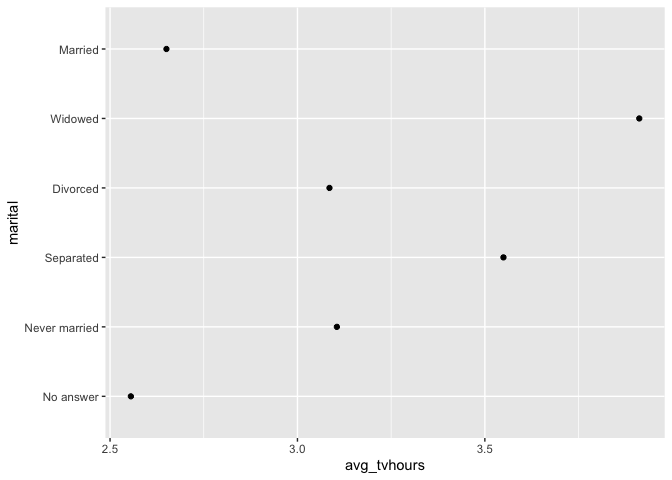
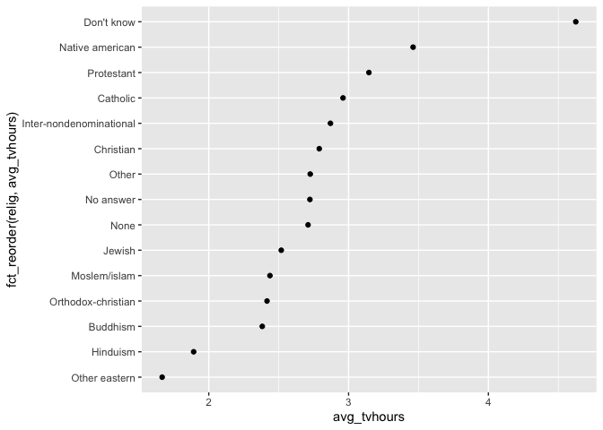
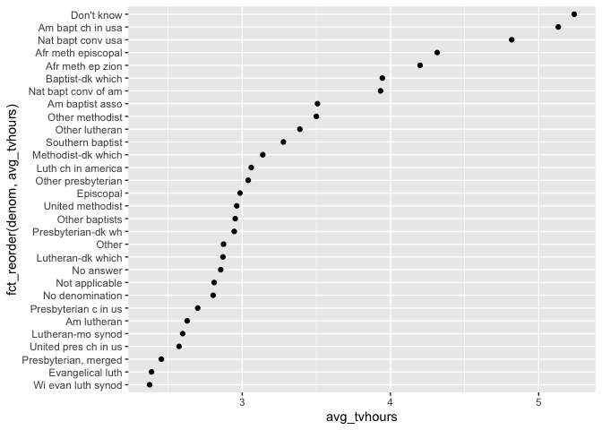
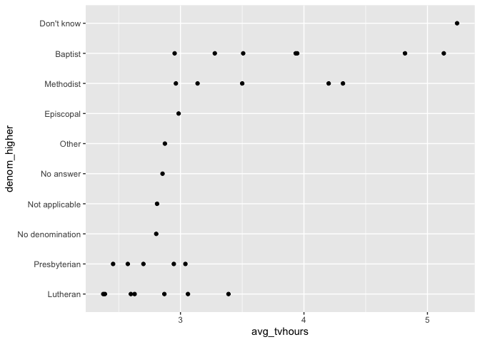
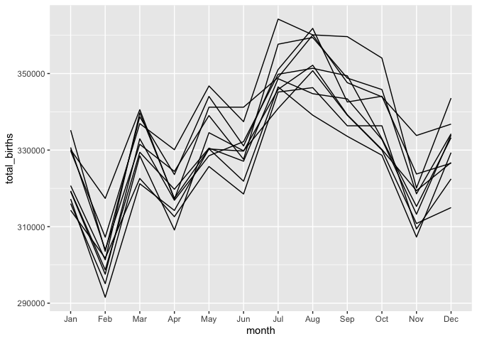

Data Types (solution)
================

``` r
library(tidyverse)
```

    ## ── Attaching packages ──────────────────────────── tidyverse 1.2.1 ──

    ## ✔ ggplot2 3.2.0     ✔ purrr   0.3.2
    ## ✔ tibble  2.1.3     ✔ dplyr   0.8.3
    ## ✔ tidyr   1.0.0     ✔ stringr 1.4.0
    ## ✔ readr   1.1.1     ✔ forcats 0.4.0

    ## ── Conflicts ─────────────────────────────── tidyverse_conflicts() ──
    ## ✖ dplyr::filter() masks stats::filter()
    ## ✖ dplyr::lag()    masks stats::lag()

``` r
library(lubridate)
```

    ## 
    ## Attaching package: 'lubridate'

    ## The following object is masked from 'package:base':
    ## 
    ##     date

## Warm-up / Review

Using the data `gss_cat`, find the average hours of tv watched
(`tvhours`) for each category of marital status (`marital`).

``` r
gss_cat %>%
  group_by(marital) %>% 
  summarise(avg_tv = mean(tvhours))
```

    ## # A tibble: 6 x 2
    ##   marital       avg_tv
    ##   <fct>          <dbl>
    ## 1 No answer         NA
    ## 2 Never married     NA
    ## 3 Separated         NA
    ## 4 Divorced          NA
    ## 5 Widowed           NA
    ## 6 Married           NA

## Your Turn 1

What kind of object is the `marital` variable?

``` r
gss_cat
```

    ## # A tibble: 21,483 x 9
    ##     year marital     age race  rincome   partyid    relig   denom   tvhours
    ##    <int> <fct>     <int> <fct> <fct>     <fct>      <fct>   <fct>     <int>
    ##  1  2000 Never ma…    26 White $8000 to… Ind,near … Protes… Southe…      12
    ##  2  2000 Divorced     48 White $8000 to… Not str r… Protes… Baptis…      NA
    ##  3  2000 Widowed      67 White Not appl… Independe… Protes… No den…       2
    ##  4  2000 Never ma…    39 White Not appl… Ind,near … Orthod… Not ap…       4
    ##  5  2000 Divorced     25 White Not appl… Not str d… None    Not ap…       1
    ##  6  2000 Married      25 White $20000 -… Strong de… Protes… Southe…      NA
    ##  7  2000 Never ma…    36 White $25000 o… Not str r… Christ… Not ap…       3
    ##  8  2000 Divorced     44 White $7000 to… Ind,near … Protes… Luther…      NA
    ##  9  2000 Married      44 White $25000 o… Not str d… Protes… Other         0
    ## 10  2000 Married      47 White $25000 o… Strong re… Protes… Southe…       3
    ## # … with 21,473 more rows

The `marital` variable is a **factor**.

Brainstorm with your neighbor, all the things you know about that kind
of object.

  - Factors are R’s way of storing categorical data.
  - They have a set of allowable values called **levels**.
  - Internally they are stored as integers.

# Factors

``` r
# Example of a factor
eyes <- factor(x = c("blue", "green", "green"), 
               levels = c("blue", "brown", "green"))
```

## Your Turn 2

Fix your summary of average hours of tv watched (`tvhours`) by marital
status (`marital`), to ignore missing values, then create a plot to
examine the results.

``` r
gss_cat %>%
  drop_na(tvhours) %>%
  group_by(marital) %>% 
  summarise(avg_tvhours = mean(tvhours)) %>%
  ggplot() +
    geom_point(aes(avg_tvhours, marital))
```

<!-- -->

## Your Turn 3

Fill in the blanks (`___`) to explore the average hours of tv watched by
religion.

``` r
gss_cat %>%
  drop_na(tvhours) %>%
  group_by(relig) %>%
  summarise(avg_tvhours = mean(tvhours)) %>%
  ggplot() +
    geom_point(mapping = aes(x = avg_tvhours, 
      y = fct_reorder(relig, avg_tvhours)))
```

<!-- -->

## Quiz

Why is this plot not very useful?

``` r
gss_cat %>%
  drop_na(tvhours) %>%
  group_by(denom) %>%
  summarise(avg_tvhours = mean(tvhours)) %>%
  ggplot() +
    geom_point(mapping = aes(x = avg_tvhours,
      y = fct_reorder(denom, avg_tvhours)))
```

<!-- -->

There are too many categories, and the categories are poorly labelled.

## Your Turn 4

Edit the code to also relabel some other Baptist denominations:

  - “Baptist-dk which”  
  - “Other baptists”

<!-- end list -->

``` r
gss_cat %>%
  mutate(denom = fct_recode(denom,
    "Baptist - Southern" = "Southern baptist",
    "Baptist - Don't know" = "Baptist-dk which",
    "Baptist - Other" = "Other baptists")
  ) %>%
  pull(denom) %>%
  levels()
```

    ##  [1] "No answer"            "Don't know"           "No denomination"     
    ##  [4] "Other"                "Episcopal"            "Presbyterian-dk wh"  
    ##  [7] "Presbyterian, merged" "Other presbyterian"   "United pres ch in us"
    ## [10] "Presbyterian c in us" "Lutheran-dk which"    "Evangelical luth"    
    ## [13] "Other lutheran"       "Wi evan luth synod"   "Lutheran-mo synod"   
    ## [16] "Luth ch in america"   "Am lutheran"          "Methodist-dk which"  
    ## [19] "Other methodist"      "United methodist"     "Afr meth ep zion"    
    ## [22] "Afr meth episcopal"   "Baptist - Don't know" "Baptist - Other"     
    ## [25] "Baptist - Southern"   "Nat bapt conv usa"    "Nat bapt conv of am" 
    ## [28] "Am bapt ch in usa"    "Am baptist asso"      "Not applicable"

## Your Turn 5

What does the function `detect_denom()` do?

``` r
detect_denom <- function(x){
  case_when(
    str_detect(x, "[Bb]ap") ~ "Baptist", 
    str_detect(x, "[Pp]res") ~ "Presbyterian",
    str_detect(x, "[Ll]uth") ~ "Lutheran",
    str_detect(x, "[Mm]eth") ~ "Methodist",
    TRUE ~ x
  )
}

gss_cat %>% pull(denom) %>% levels() %>% detect_denom()
```

    ##  [1] "No answer"       "Don't know"      "No denomination"
    ##  [4] "Other"           "Episcopal"       "Presbyterian"   
    ##  [7] "Presbyterian"    "Presbyterian"    "Presbyterian"   
    ## [10] "Presbyterian"    "Lutheran"        "Lutheran"       
    ## [13] "Lutheran"        "Lutheran"        "Lutheran"       
    ## [16] "Lutheran"        "Lutheran"        "Methodist"      
    ## [19] "Methodist"       "Methodist"       "Methodist"      
    ## [22] "Methodist"       "Baptist"         "Baptist"        
    ## [25] "Baptist"         "Baptist"         "Baptist"        
    ## [28] "Baptist"         "Baptist"         "Not applicable"

It tries to detect a higher level grouping by looking for patterns in
the denomination strings.

This is ideal for combining with `fct_revel()`:

``` r
gss_cat %>%
  drop_na(tvhours) %>%
  mutate(denom_higher = fct_relabel(denom, detect_denom) %>%
      fct_reorder(tvhours, mean)) %>%
  group_by(denom_higher, denom) %>%
  summarise(avg_tvhours = mean(tvhours)) %>%
  ggplot() +
    geom_point(mapping = aes(x = avg_tvhours,
      y = denom_higher)) 
```

<!-- -->

# Strings

With your neighbor, predict what these might return:

``` r
strings <- c("Apple", "Pineapple", "Orange")

str_detect(strings, pattern = "pp")
```

    ## [1]  TRUE  TRUE FALSE

``` r
str_detect(strings, pattern =  "apple")
```

    ## [1] FALSE  TRUE FALSE

``` r
str_detect(strings, pattern = "[Aa]pple")
```

    ## [1]  TRUE  TRUE FALSE

Then run them\!

# Times and Dates

``` r
# An example for times/dates
library(fivethirtyeight)
births <- US_births_1994_2003 %>%
  select(date, births)
```

## Your Turn 7

For each of the following formats (of the same date), pick the right
`ymd()` function to parse them:

``` r
ymd("2018 Feb 02")
```

    ## [1] "2018-02-02"

``` r
mdy("2-1-18")
```

    ## [1] "2018-02-01"

``` r
dmy("01/02/2018")
```

    ## [1] "2018-02-01"

## Your Turn 8

Fill in the blanks to:

  - Extract the month from date.
  - Extract the year from date.
  - Find the total births for each year/month.
  - Plot the results as a line chart.

<!-- end list -->

``` r
births %>%
  mutate(year = year(date),
    month = month(date, label = TRUE)) %>%
  group_by(year, month) %>%
  summarise(total_births = sum(births)) %>%
  ggplot() + 
    geom_line(aes(x = month, y = total_births, group = year))
```

<!-- -->

# Take Aways

Dplyr gives you three *general* functions for manipulating data:
`mutate()`, `summarise()`, and `group_by()`. Augment these with
functions from the packages below, which focus on specific types of
data.

| Package   | Data Type       |
| --------- | --------------- |
| forcats   | factors         |
| stringr   | strings         |
| lubridate | dates and times |
| hms       | times           |

<!-- This file by Charlotte Wickham is licensed under a Creative Commons Attribution 4.0 International License, adapted from the orignal work at https://github.com/rstudio/master-the-tidyverse by RStudio. -->
