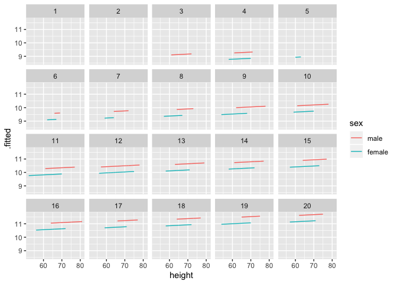
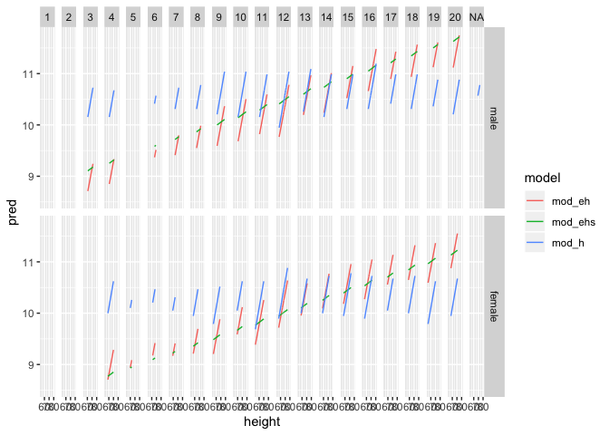

Model (solutions)
================

``` r
library(tidyverse)
library(modelr)
library(broom)

wages <- heights %>% filter(income > 0)
```

## Your Turn 1

Fit the model on the slide and then examine the output. What does it
look like?

``` r
mod_e <- lm(log(income) ~ education, data = wages)
mod_e
```

    ## 
    ## Call:
    ## lm(formula = log(income) ~ education, data = wages)
    ## 
    ## Coefficients:
    ## (Intercept)    education  
    ##      8.5577       0.1418

## Your Turn 2

Use a pipe to model `log(income)` against `height`. Then use broom and
dplyr functions to extract:

1.  The **coefficient estimates** and their related statistics
2.  The **adj.r.squared** and **p.value** for the overall model

<!-- end list -->

``` r
mod_h <- wages %>% lm(log(income) ~ height, data = .)
mod_h %>%
  tidy()
```

    ## # A tibble: 2 x 5
    ##   term        estimate std.error statistic   p.value
    ##   <chr>          <dbl>     <dbl>     <dbl>     <dbl>
    ## 1 (Intercept)   6.98     0.237        29.4 4.13e-176
    ## 2 height        0.0520   0.00352      14.8 2.44e- 48

``` r
mod_h %>% 
  glance() %>% 
  select(adj.r.squared, p.value)
```

    ## # A tibble: 1 x 2
    ##   adj.r.squared  p.value
    ##           <dbl>    <dbl>
    ## 1        0.0396 2.44e-48

## Your Turn 3

Model `log(income)` against `education` *and* `height`. Do the
coefficients change?

``` r
mod_eh <- wages %>% 
  lm(log(income) ~ education + height, data = .)

mod_eh %>% 
  tidy()
```

    ## # A tibble: 3 x 5
    ##   term        estimate std.error statistic   p.value
    ##   <chr>          <dbl>     <dbl>     <dbl>     <dbl>
    ## 1 (Intercept)   5.35     0.231        23.1 1.00e-112
    ## 2 education     0.139    0.00521      26.6 7.12e-147
    ## 3 height        0.0483   0.00331      14.6 2.50e- 47

## Your Turn 4

Model `log(income)` against `education` and `height` and `sex`. Can you
interpret the coefficients?

``` r
mod_ehs <- wages %>% 
  lm(log(income) ~ education + height + sex, data = .)

mod_ehs %>% 
  tidy()
```

    ## # A tibble: 4 x 5
    ##   term        estimate std.error statistic   p.value
    ##   <chr>          <dbl>     <dbl>     <dbl>     <dbl>
    ## 1 (Intercept)  8.25      0.335       24.6  4.68e-127
    ## 2 education    0.148     0.00520     28.5  5.16e-166
    ## 3 height       0.00673   0.00479      1.40 1.61e-  1
    ## 4 sexfemale   -0.462     0.0389     -11.9  5.02e- 32

## Your Turn 5

Use a broom function and ggplot2 to make a line graph of `height` vs
`.fitted` for our heights model, `mod_h`.

*Bonus: Overlay the plot on the original data points.*

``` r
mod_h <- wages %>% lm(log(income) ~ height, data = .)

mod_h %>% 
  augment(data = wages) %>% 
  ggplot(mapping = aes(x = height, y = .fitted)) +
    geom_point(mapping = aes(y = log(income)), alpha = 0.1) +
    geom_line(color = "blue")
```

<!-- -->

## Your Turn 6

Repeat the process to make a line graph of `height` vs `.fitted` colored
by `sex` for model mod\_ehs. Are the results interpretable? Add `+
facet_wrap(~education)` to the end of your code. What
happens?

``` r
mod_ehs <- wages %>% lm(log(income) ~ education + height + sex, data = .)

mod_ehs %>% 
  augment(data = wages) %>% 
  ggplot(mapping = aes(x = height, y = .fitted, color = sex)) +
    geom_line() +
    facet_wrap(~ education)
```

    ## geom_path: Each group consists of only one observation. Do you need to
    ## adjust the group aesthetic?
    ## geom_path: Each group consists of only one observation. Do you need to
    ## adjust the group aesthetic?

<!-- -->

## Your Turn 7

Use one of `spread_predictions()` or `gather_predictions()` to make a
line graph of `height` vs `pred` colored by `model` for each of mod\_h,
mod\_eh, and mod\_ehs. Are the results interpretable?

Add `+ facet_grid(sex ~ education)` to the end of your code. What
happens?

``` r
mod_h <- wages %>% lm(log(income) ~ height, data = .)
mod_eh <- wages %>% lm(log(income) ~ education + height, data = .)
mod_ehs <- wages %>% lm(log(income) ~ education + height + sex, data = .)

wages %>% 
  gather_predictions(mod_h, mod_eh, mod_ehs) %>% 
  ggplot(mapping = aes(x = height, y = pred, color = model)) +
    geom_line() +
    facet_grid(sex ~ education)
```

<!-- -->

-----

# Take Aways

  - Use `glance()`, `tidy()`, and `augment()` from the **broom** package
    to return model values in a data frame.

  - Use `add_predictions()` or `gather_predictions()` or
    `spread_predictions()` from the **modelr** package to visualize
    predictions.

  - Use `add_residuals()` or `gather_residuals()` or
    `spread_residuals()` from the **modelr** package to visualize
    residuals.
